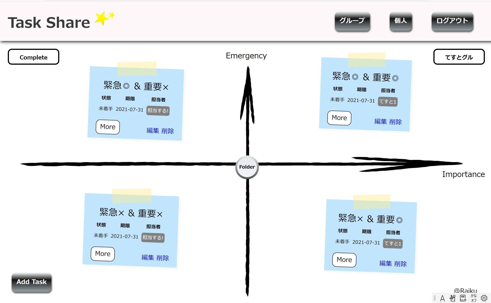
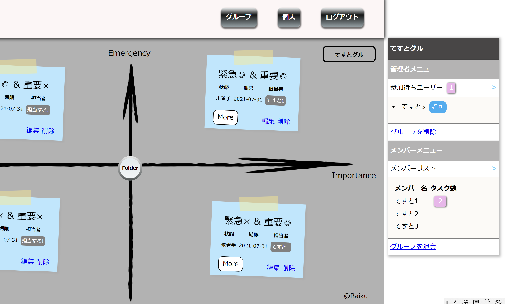
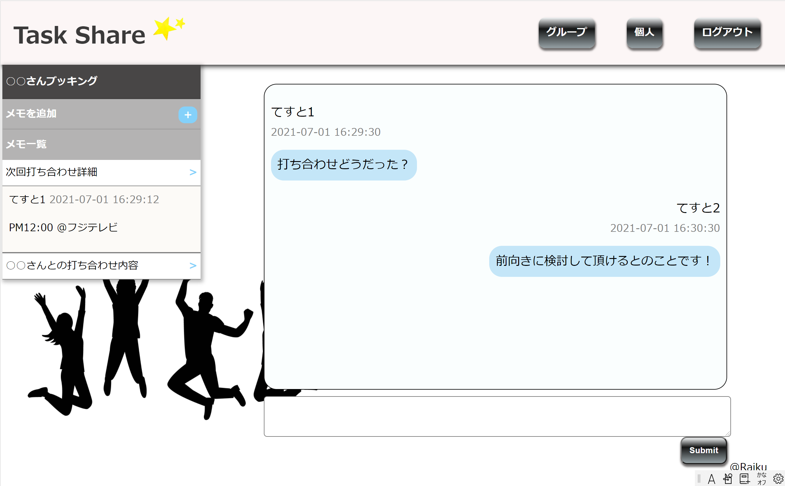

# Task Share

シンプルなデザインにより、視覚的に分かりやすいチームタスク管理アプリです。  
チーム員の担当タスク数の表示や各タスクごとのチャット&メモ機能により、タスクの振り分け・進捗管理・話し合いなど、これ一つで一括管理できます。

## 制作した目的

主に2つです。

#### 1. オンラインでも、チーム全体の進捗状況を把握できる
コロナ渦のようにオンラインでのチーム作業では情報共有の機会が圧倒的に少なくなります。  
チーム全体で「誰が何をやっているのか」を一目で把握できるようにしました。

#### 2. タスクをあとからも振り返りやすくする  
タスクごとにチャットとメモ機能を付けることで、進捗過程や要点を簡単に振り返られるようにしました。  
またチャットで「進捗過程」、メモで「まとめ」を振り返られるので、議事録などにまとめ直す手間も省けます。

## 使い方

### トップ画面
___

チームタスクが付箋メモとして表示されています。  
緊急性と重要性に応じて、ドラッグで自由に配置できます。  
またタスク内の【担当する！】により、押したユーザーの個人タスクへ追加できます。  
 
### トップ画面(サイド)
___

トップ画面右上のチーム名ボタンを押すと、チームメニューが表示されます。  
メニューではメンバー名とメンバーの担当タスク数を確認できます。  
管理者のみ管理者メニューが表示されます。
 
### チャット&メモ画面
___

トップ画面のタスク内の【More】を押すと、上記の画面が表示されます。  
各タスクごとにチャットとメモを残すことができます。  

## URL

http://heroku-task-share.herokuapp.com/  

【テストアカウント】  
メールアドレス：test1@test.com  
パスワード：test12021  

ぜひテストアカウント又は会員登録をして一度ご利用ください！

## 使用技術

・HTML/CSS  
・JavaScript  
・PHP 7.4.1  
・Laravel 6.0  
・MySQL 5.7.24  

##

## License

The Laravel framework is open-source software licensed under the [MIT license](https://opensource.org/licenses/MIT).
